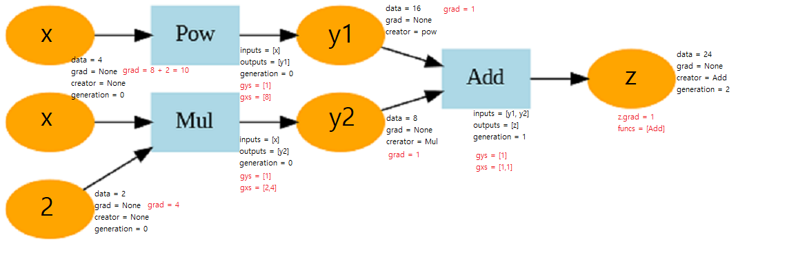

<h1>밑바닥부터 시작하는 딥러닝 3</h1>

<h2>dezero </h2>

<h3>__init__.py</h3>

<h3>core.py</h3>

#Config

-enableprop: 역전파 활성화 여부 
(Function 내에서 역전파시 필요한 inputs,outputs,generation 저장 여부를 결정)

#Variable

-data: nd.array타입

-grad: 역전파시 기록됨.

-generation: 순전파시 기록.

-backward(retaingrad, create_graph): 변수를 시작으로 역전파 진행. 

retaingrad: 말단 변수외에는 grad저장하지 않음. 

create_graph: grad 변수에 대해서도 grad 기록하여 고차 미분 가능하게함.

-creator: 변수를 출력한 함수.

#Function

-generation: 역전파시 함수를 올바른 순서로 꺼내기 위함.

-inputs: 역전파 위해 기록.(enabla_backprop변수에 따라)

-outputs: 변수를 약한참조, 역전파 위해 기록.(enabla_backprop변수에 따라)

<h3>functions.py</h3>

<h3>utils.py</h3>
